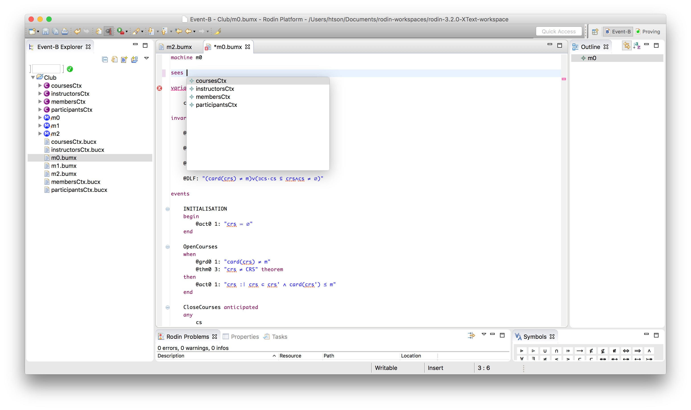

# CamilleX Overview

The CamilleX provides new CamilleX constructs (XMachines and XContexts)
which are text files which are automatically translated into the
corresponding Rodin Event-B constructs (i.e., Machine and Context)
accordingly. Facility for translating from Rodin Event-B components to
CamilleX components can be invoked manually. The overall process can be
seen in Figure [1](#fig:overview).


``` Event-B
Testing
machine
context
```

# Concepts

## XText Projects

Each project containing CamilleX constructs must be set to be XText
project. An XText project has an associated XContext and XMachine
builders that can compile CamilleX source files into Rodin files as they
are changed. The builders can be turn off via the preferences, either
workspace-wise or project-wise (see Figure [2](#fig:XContextPreference).


The XText projects must be organised such that all CamilleX constructs
has the project as the source container.

## CamilleX Builders

The CamilleX Builders, i.e., XContext builder and XMachine builder,
build CamilleX constructs, i.e., XContext and XMachine using their own
compiler. If they are enabled, the CamilleX builders are run everytime
an individual CamilleX file is saved. Problems detected by the CamilleX
builders are classified as either warnings or errors. Compile-time
errors are always reported as errors by the CamilleX buiders and in the
presence of errors, no new Rodin files are created or updated, i.e., the
CamilleX builders do not produce any new Rodin file content. In the case
of machine inclusion and event synchronisation, a flattened machine is
generated which includes data from the included machine and the
synchronised events, which can be renamed if prefixing is applied.

## Content Assist

Content assist are available for typesetting keywords and Event-B
mathematical symbols. The short-cut for invoking content assist is
`Ctrl+Space`.
Figure [\[fig:KeywordContentAssist\]](#fig:KeywordContentAssist) shows
an example for content assist with keywords.

For Event-B mathematical symbols, the key combination is defined by the
Rodin Keyboard plug-in.

# Reference

## Combmon Syntax

    ML_COMMENT ::= /* STRING */
    SL_COMMENT ::= // SL_STRING 
    ID ::= [^] (LETTER | \_) \{LETTER | DIGIT | \_ \}
    XLABEL ::= STRING:

## Preferences

### XContext Preferences

The following XContext preferences can be set on the the XContext
preference page and its sub-pages.

#### Compiler

|

<div id="tab:xcontext-compiler-preference">

|                       |                                              |           |
| :-------------------- | :------------------------------------------- | :-------- |
| Compiler is activated | **Compiler is activated** or **deactivated** | Activated |

XContext Compiler Preferences

</div>

|

#### Syntax Coloring

|

<div id="tab:xcontext-syntax-coloring-preference">

|                       |                                                     |                    |
| :-------------------- | :-------------------------------------------------- | :----------------- |
| Comment               | **Color**                                           | Dark Green         |
|                       | **Background**                                      | White              |
|                       | **Style** (Italic, Bold, Underline, Strike through) | None               |
|                       | **Font**                                            | Platform dependent |
| Default               | **Color**                                           | Black              |
|                       | **Background**                                      | White              |
|                       | **Style** (Italic, Bold, Underline, Strike through) | None               |
|                       | **Font**                                            | Platform dependent |
| Invalid Symbol        | **Color**                                           | Black              |
|                       | **Background**                                      | White              |
|                       | **Style** (Italic, Bold, Underline, Strike through) | None               |
|                       | **Font**                                            | Platform dependent |
| Keyword               | **Color**                                           | Dark Purple        |
|                       | **Background**                                      | White              |
|                       | **Style** (Italic, Bold, Underline, Strike through) | Bold               |
|                       | **Font**                                            | Platform dependent |
| Number                | **Color**                                           | Dark Gray          |
|                       | **Background**                                      | White              |
|                       | **Style** (Italic, Bold, Underline, Strike through) | None               |
|                       | **Font**                                            | Platform dependent |
| Punctuation character | **Color**                                           | Black              |
|                       | **Background**                                      | White              |
|                       | **Style** (Italic, Bold, Underline, Strike through) | None               |
|                       | **Font**                                            | Platform dependent |
| String                | **Color**                                           | Blue               |
|                       | **Background**                                      | White              |
|                       | **Style** (Italic, Bold, Underline, Strike through) | None               |
|                       | **Font**                                            | Platform dependent |
| Task Tag              | **Color**                                           | Light Blue         |
|                       | **Background**                                      | White              |
|                       | **Style** (Italic, Bold, Underline, Strike through) | Bold               |
|                       | **Font**                                            | Platform dependent |

XContext Syntax Coloring Preferences

</div>

|

### XMachine Preferences

The following XMachine preferences can be set on the XMachine preference
page and its sub-pages.

#### Compiler

|

<div id="tab:xmachine-compiler-preference">

| **Option**            | **Description**                              | **Default** |
| :-------------------- | :------------------------------------------- | :---------- |
| Compiler is activated | **Compiler is activated** or **deactivated** | Activated   |

XMachine Compiler Preferences

</div>

|

#### Syntax Coloring

|

<div id="tab:xmachine-syntax-coloring-preference">

|                       |                                                     |                    |
| :-------------------- | :-------------------------------------------------- | :----------------- |
| Comment               | **Color**                                           | Dark Green         |
|                       | **Background**                                      | White              |
|                       | **Style** (Italic, Bold, Underline, Strike through) | None               |
|                       | **Font**                                            | Platform dependent |
| Default               | **Color**                                           | Black              |
|                       | **Background**                                      | White              |
|                       | **Style** (Italic, Bold, Underline, Strike through) | None               |
|                       | **Font**                                            | Platform dependent |
| Invalid Symbol        | **Color**                                           | Black              |
|                       | **Background**                                      | White              |
|                       | **Style** (Italic, Bold, Underline, Strike through) | None               |
|                       | **Font**                                            | Platform dependent |
| Keyword               | **Color**                                           | Dark Purple        |
|                       | **Background**                                      | White              |
|                       | **Style** (Italic, Bold, Underline, Strike through) | Bold               |
|                       | **Font**                                            | Platform dependent |
| Number                | **Color**                                           | Dark Gray          |
|                       | **Background**                                      | White              |
|                       | **Style** (Italic, Bold, Underline, Strike through) | None               |
|                       | **Font**                                            | Platform dependent |
| Punctuation character | **Color**                                           | Black              |
|                       | **Background**                                      | White              |
|                       | **Style** (Italic, Bold, Underline, Strike through) | None               |
|                       | **Font**                                            | Platform dependent |
| String                | **Color**                                           | Blue               |
|                       | **Background**                                      | White              |
|                       | **Style** (Italic, Bold, Underline, Strike through) | None               |
|                       | **Font**                                            | Platform dependent |
| Task Tag              | **Color**                                           | Light Blue         |
|                       | **Background**                                      | White              |
|                       | **Style** (Italic, Bold, Underline, Strike through) | Bold               |
|                       | **Font**                                            | Platform dependent |

XMachine Syntax Coloring Preferences

</div>

|

## XEvent-B Editors

### XEvent-B Content Assist

In the XContext and XMachine editors press `Ctrl+Space` on code to
complete. This opens a list of available code completions. Some tips for
using code assist are listed in the following paragraph:

  - You can use the mouse or the keyboard (Up Arrow, Down Arrow, Page
    Up, Page Down, Home, End, Enter) to navigate and select lines in the
    list.

  - Clicking or pressing Enter on a selected line in the list inserts
    the selection into the editor.



### XEvent-B Formatter

In the XContent and XMachine editors press `Ctrl+Shift+F` on code to
format it. If no selection is set then the entire source is formatted
otherwise only the selection will be.

# Legal

## RODIN Software User Agreement

June 1st, 2006

### Usage Of Content

THE RODIN PROJECT MAKES AVAILABLE SOFTWARE, DOCUMENTATION, INFORMATION
AND/OR OTHER MATERIALS FOR OPEN SOURCE PROJECTS (COLLECTIVELY
"CONTENT"). USE OF THE CONTENT IS GOVERNED BY THE TERMS AND CONDITIONS
OF THIS AGREEMENT AND/OR THE TERMS AND CONDITIONS OF LICENSE AGREEMENTS
OR NOTICES INDICATED OR REFERENCED BELOW. BY USING THE CONTENT, YOU
AGREE THAT YOUR USE OF THE CONTENT IS GOVERNED BY THIS AGREEMENT AND/OR
THE TERMS AND CONDITIONS OF ANY APPLICABLE LICENSE AGREEMENTS OR NOTICES
INDICATED OR REFERENCED BELOW. IF YOU DO NOT AGREE TO THE TERMS AND
CONDITIONS OF THIS AGREEMENT AND THE TERMS AND CONDITIONS OF ANY
APPLICABLE LICENSE AGREEMENTS OR NOTICES INDICATED OR REFERENCED BELOW,
THEN YOU MAY NOT USE THE CONTENT.

### Applicable Licences

Unless otherwise indicated, all Content made available by the CODA
project is provided to you under the terms and conditions of one of the
following licences.Unless otherwise indicated, all Content made
available by the Rodin Project is provided to you under the terms and
conditions of the Eclipse Public License Version 1.0 (“EPL”). A copy of
the EPL is provided with this Content and is also available at
<http://www.eclipse.org/legal/epl-v10.html>. For purposes of the EPL,
“Program” will mean the Content.

Content includes, but is not limited to, source code, object code,
documentation and other files maintained in the Rodin SourceForge CVS
repository (“Repository”) in CVS modules (“Modules”) and made available
as downloadable archives (“Downloads”).

  - Content may be structured and packaged into modules to facilitate
    delivering, extending, and upgrading the Content. Typical modules
    may include plug-ins (“Plug-ins”), plug-in fragments (“Fragments”),
    and features (“Features”).

  - Each Plug-in or Fragment may be packaged as a sub-directory or JAR
    (JavaARchive) in a directory named “plugins”.

  - A Feature is a bundle of one or more Plug-ins and/or Fragments and
    associated material. Each Feature may be packaged as a sub-directory
    in a directory named “features”. Within a Feature, files named
    “feature.xml” may contain a list of the names and version numbers
    of the Plug-ins and/or Fragments associated with that Feature.

  - Features may also include other Features (“Included Features”).
    Within a Feature, files named “feature.xml” may contain a list of
    the names and version numbers of Included Features.

The terms and conditions governing Plug-ins and Fragments should be
contained in files named “about.html” (“Abouts”). The terms and
conditions governing Features and Included Features should be contained
in files named “license.html” (“Feature Licenses”). Abouts and Feature
Licenses may be located in any directory of a Download or Module
including, but not limited to the following locations:

  - The top-level (root) directory

  - Plug-in and Fragment directories

  - Inside Plug-ins and Fragments packaged as JARs

  - Sub-directories of the directory named "src" of certain Plug-ins

  - Feature directories

Note: if a Feature made available by the Rodin Project is installed
using the Eclipse Update Manager, you must agree to a license (“Feature
Update License”) during the installation process. If the Feature
contains Included Features, the Feature Update License should either
provide you with the terms and conditions governing the Included
Features or inform you where you can locate them. Feature Update
Licenses may be found in the “license” property of files named
“feature.properties” found within a Feature. Such Abouts, Feature
Licenses, and Feature Update Licenses contain the terms and conditions
(or references to such terms and conditions) that govern your use of the
associated Content in that directory.

THE ABOUTS, FEATURE LICENSES, AND FEATURE UPDATE LICENSES MAY REFER TO
THE EPL OR OTHER LICENSE AGREEMENTS, NOTICES OR TERMS AND CONDITIONS.
SOME OF THESE OTHER LICENSE AGREEMENTS MAY INCLUDE (BUT ARE NOT LIMITED
TO):

  - Common Public License Version 1.0 (available at
    <http://www.eclipse.org/legal/cpl-v10.html>)

  - Apache Software License 1.1 (available at
    <http://www.apache.org/licenses/LICENSE>)

  - Apache Software License 2.0 (available at
    <http://www.apache.org/licenses/LICENSE-2.0>)

  - IBM Public License 1.0 (available at
    <http://oss.software.ibm.com/developerworks/opensource/license10.html>)

  - Metro Link Public License 1.00 (available at
    <http://www.opengroup.org/openmotif/supporters/metrolink/license.html>)

  - Mozilla Public License Version 1.1 (available at
    <http://www.mozilla.org/MPL/MPL-1.1.html>)

IT IS YOUR OBLIGATION TO READ AND ACCEPT ALL SUCH TERMS AND CONDITIONS
PRIOR TO USE OF THE CONTENT. If no About, Feature License, or Feature
Update License is provided, please contact the Rodin Project to
determine what terms and conditions govern that particular Content.

### Cryptography

Content may contain encryption software. The country in which you are
currently may have restrictions on the import, possession, and use,
and/or re-export to another country, of encryption software. BEFORE
using any encryption software, please check the country’s laws,
regulations and policies concerning the import, possession, or use, and
re-export of encryption software, to see if this is permitted.

>   - Java and all Java-based trademarks are trademarks of Sun
>     Microsystems, Inc. in the United States, other countries, or both.

# Release Notes

#### 1.0.0

The feature is now called CamilleX (instead of XEvent-B)

  - Branding (0.0.4): Updated logo to CamilleX.

  - Common (0.0.5): Update copyright statements in source code.

  - Cheatsheets (1.0.0): Updated the name to use CamilleX instead of
    XEvent-B.

  - Documentation (1.0.0): Updated the name to use CamilleX instead of
    XEvent-B.

  - UI (0.1.0): Updated the name to use CamilleX instead of XEvent-B.

  - XContext (1.0.0): Updated the name to use CamilleX instead of
    XEvent-B.
    
      - Update dependency ranges

  - XContext IDE (1.0.0): Updated the name to use CamilleX instead of
    XEvent-B.
    
      - Update dependency ranges

  - XContext UI (1.0.0): Updated the name to use CamilleX instead of
    XEvent-B.
    
      - Update dependency ranges

  - XMachine (1.0.0): Updated the name to use CamilleX instead of
    XEvent-B.
    
      - Update dependency ranges

  - XMachine IDE (1.0.0): Updated the name to use CamilleX instead of
    XEvent-B.
    
      - Update dependency ranges

  - XMachine UI (1.0.0): Updated the name to use CamilleX instead of
    XEvent-B.
    
      - Update dependency ranges

#### 0.0.7

  - XEvent-B Branding (0.0.3): Updated logo to XEvent-B.

  - XEvent-B Common (0.0.4): Enhancement (Issue \#11).
    
      - Machines from different projects can now be included.
    
      - Machines are now included using qualified name defined as:
        *projectName.machineName*

  - XEvent-B Documentations (0.0.7): Update documentation for 0.0.7
    release.

  - XEvent-B XContext (0.0.5): Changed dependency on XText to \[2.12.0,
    3.0.0).

  - XEvent-B XContext IDE (0.0.4): Changed dependency on XText to
    \[2.12.0, 3.0.0).

  - XEvent-B XContext UI (0.0.4): Changed dependency on XText to
    \[2.12.0, 3.0.0).

  - XEvent-B XMachine (0.0.5):
    
      - Changed dependency on XText to \[2.12.0, 3.0.0).
    
      - Fixed Issue \#8: Comments are not parsed.
    
      - Fixed Issue \#10: Variants not translated: Fix is part of
        inclusion plug-in release 0.2.0.
    
      - Flattened machines now have the included machine elements
        generated before the source machine.
    
      - Order of generating elements of multiple inclusions and/or
        instances is from last to first.
    
      - This update is part of inclusion plug-in release 0.2.0.

  - XEvent-B XMachine IDE (0.0.4): Changed dependency on XText to
    \[2.12.0, 3.0.0).

  - XEvent-B XMachine UI (0.0.4):
    
      - Changed dependency on XText to \[2.12.0, 3.0.0).
    
      - Regenerated from XEvent-B XMachine 0.0.5

#### 0.0.6

  - Renamed plug-ins and features to XEvent-B (instead of Event-B
    XText).

  - XEvent-B Branding (0.0.2): Renamed from Event-B XText Branding.

  - XEvent-B Documentations (0.0.2): Renamed from Event-B XText
    Documentations.

  - XEvent-B Cheatsheets (0.0.2): Renamed from Event-B XText
    Cheatsheets.

  - XEvent-B Common (0.0.3): Renamed from Event-B XText Common.

  - XEvent-B UI (0.0.2): Renamed from Event-B XText UI.

  - XEvent-B XContext (0.0.4): Renamed from Event-B XText Context.

  - XEvent-B XContext IDE (0.0.3): Renamed from Event-B XText Context
    IDE.

  - XEvent-B XContext UI (0.0.3): Renamed from Event-B Context UI.

  - XEvent-B XMachine (0.0.4): Renamed from Event-B XText Machine.
    
      - Support Machine Inclusion and Event Synchronisation.

  - XEvent-B XMachine IDE (0.0.3): Renamed from Event-B XText Machine
    IDE.

  - XEvent-B XMachine UI (0.0.3): Renamed from Event-B XText Machine UI.

#### 0.0.5

  - Event-B XText Documentations (0.0.1): Documentation plug-in (Initial
    version).

#### 0.0.4

  - Updated plug-in dependency for the feature

#### 0.0.3

  - Event-B XText Context (0.0.3):
    
      - Issue \#3: Single-line comment after the element, multi-line
        comment before the element

  - Event-B XText Context IDE (0.0.2): Regenerated

  - Event-B XText ContextUI IDE (0.0.2): Regenerated

  - Event-B XText Machine (0.0.3):
    
      - Issue \#3: Single-line comment after the element, multi-line
        comment before the element.
    
      - Issue \#5: Event terminator using ’end’ keyword instead of ’;’

  - Event-B XText Machine IDE (0.0.2) Regenerated

  - Event-B XText Machine UI IDE (0.0.2) Regenerated

#### 0.0.2

  - Event-B XText Common (0.0.2):
    
      - Added transient value service for XContext and XMachine.

  - Event-B XText Context (0.0.2):
    
      - Added formatter (used for auto-indentation).

  - Event-B XText Machine (0.0.2):
    
      - Added formatter (used for auto-indentation).

  - Event-B XText UI (0.0.1): Initial version
    
      - Added context menu for converting machines and contexts to
        XText.

#### 0.0.1

Initial version contains the following plug-ins:

  - Event-B XText Branding (0.0.1) Initial version: Branding information

  - Event-B XText Common (0.0.1) Initial version: Common facilities

  - Event-B XText Context (0.0.1) Initial version: Core support for
    Event-B contexts

  - Event-B XText Context IDE (0.0.1) Initial version: IDE for Event-B
    contexts

  - Event-B XText Context UI (0.0.1) Initial version: UI for Event-B
    contexts

  - Event-B XText Machine (0.0.1) Initial version: Core support for
    Event-B machines

  - Event-B XText Machine IDE (0.0.1) Initial version: IDE for Event-B
    machines

  - Event-B XText Machine UI (0.0.1) Initial version: UI for Event-B
    machines
